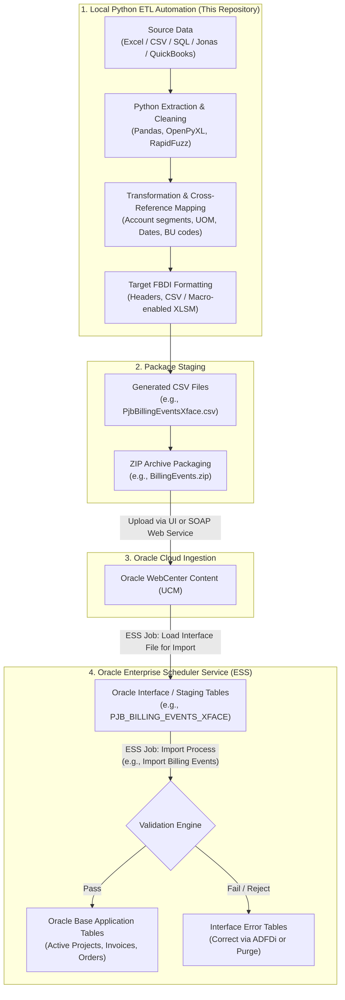

# AirControl Automation Scripts - FBDI & Integration Suite

[](https://www.python.org/)
[](https://www.oracle.com/cloud/erp/)
[]()
[](https://github.com/Vishalwalunj5601/AutomationScripts)

Enterprise-grade data conversion, integration, reconciliation, and validation pipelines for **Air Control Concepts** and subsidiary entities (Airetech, Etairos, CJBS, etc.).

This repository specializes in transforming complex legacy ERP, CRM, and accounting extracts into **Oracle Fusion Cloud File-Based Data Import (FBDI)** packages, **HCM Data Loader (HDL)** payloads, and **ADFDi** datasets across Financials, Project Portfolio Management (PPM), Supply Chain Management (SCM), Procurement, and Cloud HCM.

---

## Table of Contents
1. [What is FBDI (File-Based Data Import)?](#what-is-fbdi-file-based-data-import)
   - [Why Oracle Uses FBDI](#why-oracle-uses-fbdi)
   - [The Complete End-to-End FBDI Lifecycle](#the-complete-end-to-end-fbdi-lifecycle)
2. [Module & FBDI Interface Matrix](#module--fbdi-interface-matrix)
3. [Architecture & Module Breakdown](#architecture--module-breakdown)
   - [1. AiretechProjects](#1-airetechprojects)
   - [2. ApInvoice (Accounts Payable)](#2-apinvoice-accounts-payable)
   - [3. ArInvoice (Accounts Receivable AutoInvoice)](#3-arinvoice-accounts-receivable-autoinvoice)
   - [4. Customer (TCA Master & ADFDi)](#4-customer-tca-master--adfdi)
   - [5. DuplicateParty (Fuzzy Match Deduplication)](#5-duplicateparty-fuzzy-match-deduplication)
   - [6. Employee (HCM Data Loader - HDL)](#6-employee-hcm-data-loader---hdl)
   - [7. Opportunity (CRM SharePoint Linking)](#7-opportunity-crm-sharepoint-linking)
   - [8. Projects (PPM Conversion & Tieback)](#8-projects-ppm-conversion--tieback)
   - [9. PurchaseOrder (Procurement FBDI)](#9-purchaseorder-procurement-fbdi)
   - [10. SalesOrderMapping (Order Management Mapping)](#10-salesordermapping-order-management-mapping)
   - [11. Supplier (Payables Supplier FBDI)](#11-supplier-payables-supplier-fbdi)
4. [Prerequisites & Environment Setup](#prerequisites--environment-setup)
5. [How to Run the Automation Workflows](#how-to-run-the-automation-workflows)
6. [Repository Structure](#repository-structure)

---

## What is FBDI (File-Based Data Import)?

### Why Oracle Uses FBDI
**File-Based Data Import (FBDI)** is Oracle Fusion Cloud Applications' native, high-volume data ingestion mechanism. When migrating historical data or integrating legacy systems (QuickBooks, Jonas, Excel workbooks, bespoke ERPs) into Oracle Fusion Cloud, REST or SOAP APIs can become bottlenecks for tens or hundreds of thousands of records.

FBDI provides:
* **Bulk Throughput:** Optimized database load speeds capable of processing millions of rows via Oracle Enterprise Scheduler (ESS) batch jobs.
* **Database Staging Isolation:** Data first lands in temporary **Interface Tables** (`*_INT` / `*_INTERFACE`), isolating core business tables from corrupt or malformed inputs.
* **Built-in Business Logic Validation:** Oracle's core validation engines inspect foreign keys, accounting rules, cross-validation rules (CVRs), and flexfields before creating official records.
* **Exception Workbenches (ADFDi):** Errored records remain in interface tables and can be corrected in bulk using Excel-based Oracle ADFDi add-ins or purged and re-imported.

---

### The Complete End-to-End FBDI Lifecycle

The scripts in this repository automate **Stages 1 through 3** of the FBDI lifecycle:



1. **Extraction & Standardization:** Python scripts ingest raw source files, standardize dates into Oracle's canonical `YYYY/MM/DD` format, strip illegal characters, harmonize casing, and normalize phone/address fields.
2. **Business Unit & Segment Derivation:** Generates complete 9-segment accounting flexfields (`Company.Branch.LOB.Dept.Account.IC.AddBack.ProdLine.Future`), procurement/requisitioning BUs, and party identifiers.
3. **FBDI CSV Generation:** Produces strictly formatted, header-matched CSV files conforming exactly to Oracle's interface specifications.
4. **ZIP Packaging:** Compresses one or more related CSV files into a `.zip` file expected by Oracle's **Load Interface File for Import** ESS job.
5. **Oracle Load & Import Execution:**
   * Step 1: Run ESS Job **"Load Interface File for Import"** (Select Import Process and upload the ZIP file from UCM).
   * Step 2: Run module-specific **"Import <Entity>"** ESS Job to validate and move records from staging into production tables.

---

## Module & FBDI Interface Matrix

| Module | Python Script | Oracle Cloud Area | Target FBDI Template / Interface Table / HDL Object | Associated Oracle ESS Import Job |
| :--- | :--- | :--- | :--- | :--- |
| **AiretechProjects** | `BillingEvents.py` | PPM (Billing) | `PjbBillingEventsXface.csv` / `PJB_BILLING_EVENTS_XFACE` | Import Billing Events |
| **AiretechProjects** | `ContractsV1.py` | Enterprise Contracts | `OKC_CONTRACT_HEADERS_INT`, `OKC_CONTRACT_LINES_INT` | Import Contracts |
| **AiretechProjects** | `CostImport.py` | PPM (Costing) | `PjfProjectCostsInt.csv` / `PJF_PROJECT_COSTS_INT` | Import Project Miscellaneous Costs |
| **AiretechProjects** | `FinancialPlan.py` | PPM (Planning) | `PjoPlanLinesInterface.csv` / `PJO_PLAN_LINES_INTERFACE` | Import Project Financial Plan |
| **AiretechProjects** | `ProjectImport.py` | PPM (Projects) | `ProjectImportTemplate.xlsm` (`PJF_PROJECTS_INT`, `PJF_TASKS_INT`, `PJF_PROJECT_MEMBERS_INT`) | Import Projects |
| **ApInvoice** | `ApInvoice.py` | Financials (AP) | `AP_INVOICES_INTERFACE`, `AP_INVOICE_LINES_INTERFACE` | Import Payables Invoices |
| **ArInvoice** | `ArInvoice.py`, `ArInvoiceTax.py` | Financials (AR) | `RA_INTERFACE_LINES_ALL`, `RA_INTERFACE_DISTRIBUTIONS_ALL`, `RA_INTERFACE_SALES_CREDITS_ALL` | Import AutoInvoice |
| **Customer** | `Customer.py`, `CustomerProfileAccountSite.py` | TCA / Receivables | `HZ_IMP_PARTIES_T`, `HZ_IMP_ACCOUNTS_T`, `HZ_IMP_ACCTSITES_T`, `HZ_IMP_SITEUSES_T` | Import Customer Information |
| **Employee** | `EmployeeLoad.py`, `EmployeeLoadOffset2Days.py` | Cloud HCM | `Worker.dat` (HDL: Worker, PersonName, Email, Phone, Address, WorkRelationship, Assignment, Supervisor) | Import and Load HCM Data |
| **Employee** | `UserAccountActive.py`, `Users.py` | Cloud Security / HCM | `User.dat` (HDL User & Role Mapping) | Import and Load HCM Data |
| **Projects** | `BillingEventImport.py` | PPM (Billing) | `PJB_BILLING_EVENTS_XFACE` | Import Billing Events |
| **Projects** | `Contracts.py` | Enterprise Contracts | `OKC_CONTRACT_HEADERS_INT` | Import Contracts |
| **Projects** | `CostImport.py` | PPM (Costing) | `PJF_PROJECT_COSTS_INT` | Import Project Miscellaneous Costs |
| **Projects** | `FinancialPlanImport.py` | PPM (Planning) | `PJO_PLAN_LINES_INTERFACE` | Import Project Financial Plan |
| **Projects** | `ProjectForecast.py` | PPM (Planning) | Project Plan Baseline & Forecast Interface | Import Project Financial Plan |
| **PurchaseOrder** | `PurchaseOrder.py` | Procurement (PO) | `PO_HEADERS_INTERFACE`, `PO_LINES_INTERFACE`, `PO_LINE_LOCATIONS_INTERFACE`, `PO_DISTRIBUTIONS_INTERFACE` | Import Orders |
| **SalesOrderMapping** | `CustomerMapping.py`, `SalesOrderGenericMapping.py` | Order Management | TCA Customer Party Sites & Sales Order Staging | Import Sales Orders |
| **Supplier** | `Supplier.py` | Procurement / AP | `POZ_SUPPLIERS_INT`, `POZ_SUPPLIER_SITES_INT`, `POZ_SUPPLIER_ADDRESSES_INT` | Import Suppliers |

---

## Architecture & Module Breakdown

### 1. AiretechProjects
Specialized FBDI generation for Airetech entities into Oracle Fusion PPM:
* **`BillingEvents.py`**: Ingests job billing records from legacy accounting systems, segregates paid vs. unpaid billing events, calculates invoice distributions, and outputs FBDI-ready `Paid_PjbBillingEventsXface.csv` and `Unpaid_PjbBillingEventsXface.csv` files.
* **`ContractsV1.py`**: Generates enterprise contract import templates (`OKC_CONTRACT_HEADERS_INT`, lines, and billing terms) linking projects to customer billing accounts.
* **`CostImport.py`**: Extracts labor, subcontractor, and material costs, deriving expenditure types and debit/credit natural accounts.
* **`FinancialPlan.py`**: Generates financial plan baselines, cost resource assignments, and margin targets for active projects.
* **`ProjectImport.py`**: Automates multi-sheet FBDI generation for Projects, WBS Tasks, and Team Member roles with dynamic office mapping (Tulsa, Springdale, Little Rock).

### 2. ApInvoice (Accounts Payable)
Automates creation of Oracle Payables FBDI spreadsheets:
* **`ApInvoice.py`**: Reads legacy AP transactions and supplier master files.
  - Generates `AP_INVOICES_INTERFACE` (Invoice ID, Business Unit, Invoice Number, Amount, Dates, Terms, Accounting Date).
  - Generates `AP_INVOICE_LINES_INTERFACE` (Item lines, Tax lines, PO Number references, and GL code combinations).

### 3. ArInvoice (Accounts Receivable AutoInvoice)
FBDI generation for open billing conversion into Oracle Receivables:
* **`ArInvoice.py`**: Maps legacy billing lines to `RA_INTERFACE_LINES_ALL`. Builds revenue (`REV`) and receivable (`REC`) accounting flexfield segments (`Company.Branch.LOB.Dept.Account.IC.AddBack.ProdLine.Future`) and salesperson quota credit splits.
* **`ArInvoiceTax.py`**: Incorporates tax line generation, tax classification codes, and Vertex tax integration attributes.

### 4. Customer (TCA Master & ADFDi)
Constructs Oracle Trading Community Architecture (TCA) party registries:
* **`Customer.py`**: Parses legacy customer datasets, splits contact names, creates customer registry IDs, accounts, and bill-to/ship-to site uses.
* **`CustomerProfileAccountSite.py`**: Generates site-level profile classes, credit currency settings, and payment terms.

### 5. DuplicateParty (Fuzzy Match Deduplication)
Data quality and deduplication engine powered by `RapidFuzz` / `SequenceMatcher`:
* **`DuplicateParty.py` & `DuplicatePartyCustomer.py`**: Detects duplicate customer/supplier entries across source systems using configurable token-ratio thresholds, preventing duplicate party creation in Oracle TCA.
* **`DuplicatePartyD.py`**: Generates audit and exception workbooks for business data stewards.

### 6. Employee (HCM Data Loader - HDL)
Automates workforce migration into Oracle Cloud HCM:
* **`EmployeeLoad.py`**: Generates pipe-delimited `Worker.dat` files covering Person, Name, Work Relationship, Employment Terms, Assignments, and Supervisor hierarchies.
* **`EmployeeLoadOffset2Days.py`**: Adjusts hire dates with a 2-day offset to align with Oracle cutover and payroll period requirements.
* **`UserAccountActive.py` & `Users.py`**: Prepares user provisioning files for active employees.

### 7. Opportunity (CRM SharePoint Linking)
* **`SharepointLink.py`**: Validates, normalizes, and regenerates SharePoint deep links for CRM opportunity attachments.

### 8. Projects (PPM Conversion & Tieback)
Core project conversion and financial plan generation:
* **`BillingEventImport.py`**: Generates FBDI billing events with paid/unpaid status reconciliation.
* **`Contracts.py` & `CostImport.py`**: Project contract header and actual cost FBDI transformations.
* **`FinancialPlanImport.py` & `ProjectForecast.py`**: Populates multi-period planning resources, baseline budgets, and forecasting lines.

### 9. PurchaseOrder (Procurement FBDI)
* **`PurchaseOrder.py`**: Transforms legacy open PO files into Oracle Procurement FBDI templates (`PO_HEADERS_INTERFACE`, `PO_LINES_INTERFACE`, `PO_LINE_LOCATIONS_INTERFACE`, `PO_DISTRIBUTIONS_INTERFACE`), supporting buyer mapping, item cross-referencing, and negative quantity exclusion sheets.

### 10. SalesOrderMapping (Order Management Mapping)
* **`CustomerMapping.py`**: Maps legacy customer records to Oracle Fusion `PARTY_NAME`, `PARTY_NUMBER`, `PARTY_SITE_ID`, and `SITE_USE_ID`.
* **`SalesOrderGenericMapping.py`**: Resolves shipping and billing addresses to Oracle Party Sites using fuzzy string matching.

### 11. Supplier (Payables Supplier FBDI)
* **`Supplier.py`**: Comprehensive transformation into Oracle Supplier FBDI interfaces:
  - `POZ_SUPPLIERS_INT`: Supplier header, Tax Organization Type, Taxpayer ID formatting (`XX-XXXXXXX`), Federal 1099 reporting flags.
  - `POZ_SUPPLIER_ADDRESSES_INT`: Cleaned street addresses, phone/fax parsing (country code, area code, number).
  - `POZ_SUPPLIER_SITES_INT`: Procurement BU assignment, Purchasing/Pay site flags, payment terms.

---

## Prerequisites & Environment Setup

### 1. Python Environment
Python 3.10 or higher is required.

```powershell
# Clone the repository
git clone https://github.com/Vishalwalunj5601/AutomationScripts.git
cd AutomationScripts

# Create and activate virtual environment
python -m venv venv
.\venv\Scripts\Activate.ps1

# Install required dependencies
pip install -r requirements.txt
```

### 2. Core Dependencies
* `pandas` >= 2.0.0 (Data extraction, transformation, filtering)
* `openpyxl` >= 3.1.0 (Excel workbook manipulation)
* `xlsxwriter` >= 3.1.0 (Formatted Excel output generation)
* `python-dateutil` >= 2.8.2 (Flexible date parsing and relativedelta arithmetic)
* `RapidFuzz` / `difflib` (High-performance fuzzy address and party matching)

---

## How to Run the Automation Workflows

### 1. Running Project Import FBDI
```powershell
python AiretechProjects\ProjectImport.py
```
* **Inputs:** Jonas TAB pull workbook (`TAB Pull from Jonas 9-18.xlsx`).
* **Outputs:** `ProjectImportTemplate_Populated.xlsx` / `.xlsm` ready for conversion to CSV and ZIP.

### 2. Running AP Invoice FBDI
```powershell
python ApInvoice\ApInvoice.py
```
* **Inputs:** `APInvoiceInputFile.xlsx` (SourceData and SupplierData sheets).
* **Outputs:** `Etairos_ApInvoiceOutput1.xlsx` containing `AP_INVOICES_INTERFACE` and `AP_INVOICE_LINES_INTERFACE` tabs.

### 3. Running PO FBDI
```powershell
python PurchaseOrder\PurchaseOrder.py
```
* **Inputs:** `PO_InputFile.xlsx` (Header, Lines, Supplier, Buyer, Item sheets).
* **Outputs:** `PO_FBDI_Output2.xlsx` containing all four interface tabs plus excluded record sheets.

### 4. Running HCM Worker HDL Generation
```powershell
python Employee\EmployeeLoad.py
```
* **Inputs:** Master employee CSV/Excel and Reference Job mapping file.
* **Outputs:** `Worker-MOCK-FINAL-2.dat` formatted for direct upload via Oracle HCM Data Loader.

---

## Repository Structure

```text
AutomationScripts/
├── AiretechProjects/
│   ├── BillingEvents.py
│   ├── ContractsV1.py
│   ├── CostImport.py
│   ├── FinancialPlan.py
│   └── ProjectImport.py
├── ApInvoice/
│   └── ApInvoice.py
├── ArInvoice/
│   ├── ArInvoice.py
│   └── ArInvoiceTax.py
├── Customer/
│   ├── Customer.py
│   └── CustomerProfileAccountSite.py
├── DuplicateParty/
│   ├── DuplicateParty - Copy.py
│   ├── DuplicateParty.py
│   ├── DuplicatePartyCustomer.py
│   └── DuplicatePartyD.py
├── Employee/
│   ├── EmployeeLoad.py
│   ├── EmployeeLoadOffset2Days.py
│   ├── UserAccountActive.py
│   └── Users.py
├── Opportunity/
│   └── SharepointLink.py
├── Projects/
│   ├── BillingEventImport.py
│   ├── Contracts.py
│   ├── CostImport.py
│   ├── FinancialPlanImport.py
│   └── ProjectForecast.py
├── PurchaseOrder/
│   └── PurchaseOrder.py
├── SalesOrderMapping/
│   ├── CustomerMapping.py
│   └── SalesOrderGenericMapping.py
├── Supplier/
│   └── Supplier.py
├── .gitignore
└── README.md
```
